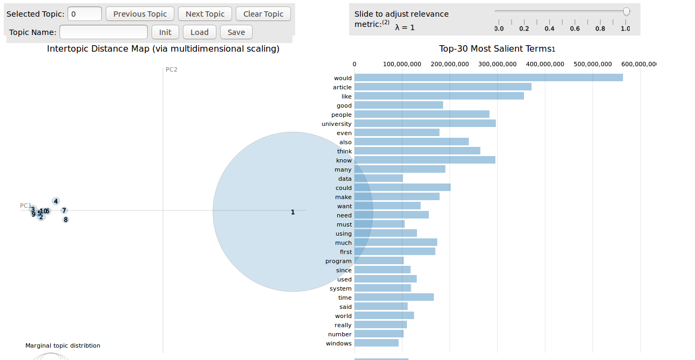

A vanilla Scala port of https://github.com/bmabey/pyLDAvis using Apache Spark as backend

# How to use?
You can link against this library in your program at the following coordinates:

**Scala 2.11**
```
groupId: com.github.iaja
artifactId: scalaldavis_2.11
version: 0.1.0
```

## With SBT

```scala
libraryDependencies ++= "com.github.iaja" % "scalaldavis_2.11" % "0.1.0"
```

# Examples
- [Data Preparation](examples/src/main/scala/DataPreparation.scala)
- [Scala LDA Visulaization](examples/src/main/scala/LDAVis.scala)
- [pyLDAvis Code Exploration](examples/python/pyLDAvis.ipynb) 
- [Prebuild artifacts](examples/tmp/scalaLDAvis)

 
  
 ### References
 - http://www.jmlr.org/papers/volume3/blei03a/blei03a.pdf
 - http://ai.stanford.edu/~ang/papers/nips01-lda.pdf
 - https://nlp.stanford.edu/pubs/llda-emnlp09.pdf
 - https://nlp.stanford.edu/events/illvi2014/papers/sievert-illvi2014.pdf
 - https://github.com/bmabey/pyLDAvis
 
 ### Dataset
 - [20 Newsgroups](http://qwone.com/~jason/20Newsgroups/)
                                               